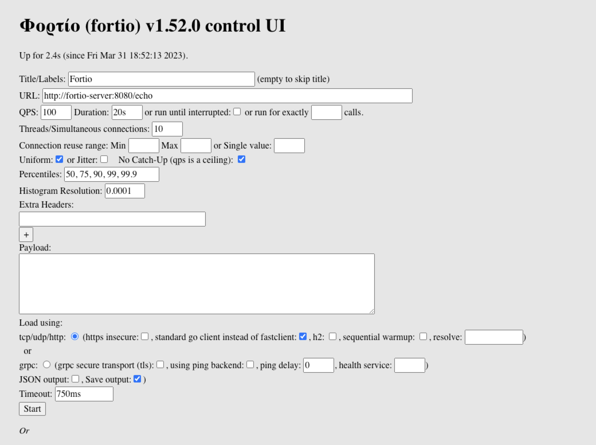

# Test Istio performance in different scenarios

My seminar paper experiment for CS-E4000 - Seminar in Computer Science

# Prerequisites
* [minikube](https://minikube.sigs.k8s.io/docs/)
* [istio](https://istio.io/)
* [fortio](https://github.com/fortio/fortio)

# Run
I test it on my own laptop, MacOs 13.1 baed on ARM chip.

## Mutual TLS
```
minikube start
istioctl install --set profile=demo -y
kubectl label namespace default istio-injection=enabled   # enable istio injection
minikube tunnel


cd benchmark
eval $(minikube -p minikube docker-env)
docker compose build
kubectl apply -f mtls.yaml
kubectl apply -f fortio-server.yaml
kubectl apply -f fortio-client.yaml
kubectl apply -f fortio-gateway.yaml

kubectl exec `kubectl get pod -l app=fortio-client -o  jsonpath='{.items[0].metadata.name}'` -it -- fortio server

# open browser and go to http://localhost/client/fortio/ and the target url is http://fortio-server:8080/echo

# using API to test
fortio curl -stdclient -payload-file sample.json "http://localhost/client/fortio/rest/run?jsonPath=.metadata"
// {"message":"started","RunID":10,"Count":1,"ResultID":"2023-03-31-204117_10","ResultURL":"http://localhost:8080/fortio/data/2023-03-31-204117_10.json"}

curl  "http://localhost/client/fortio/rest/status?runid=1"
{"Statuses":{"10":{"RunID":10,"State":2,"RunnerOptions":{"RunType":"HTTP","QPS":40,"Duration":20000000000,"NumThreads":10,"Percentiles":[50,75,90,99,99.9],"Resolution":0.001,"Labels":"","Exactly":0,"Jitter":false,"Uniform":false,"RunID":10,"Offset":0,"NoCatchUp":false,"ID":"2023-03-31-204117_10"}}}}

# copy the result
kubectl cp `kubectl get pod -l app=fortio-client -o  jsonpath='{.items[0].metadata.name}'`:2023-03-31-204117_10.json ./file.json

# delete
kubectl delete -f mtls.yaml
kubectl delete -f fortio-server.yaml
kubectl delete -f fortio-client.yaml
kubectl delete -f fortio-gateway.yaml
kubectl label namespace default istio-injection-   # disable istio injection
istioctl uninstall -y --purge 
```


If you want show the result that I have done, you can run the following command:
```
cd benchmark
fortio report 

# open browser and go to http://localhost:8080/
```

TODO
* turn off mTLS
* calculate the netfilter overhead and bpf overhead using perf and eBPF
* test other server mesh mode
    * grpc proxyless (Istio)
    * Istio ambient
    * Cilium Service Mesh